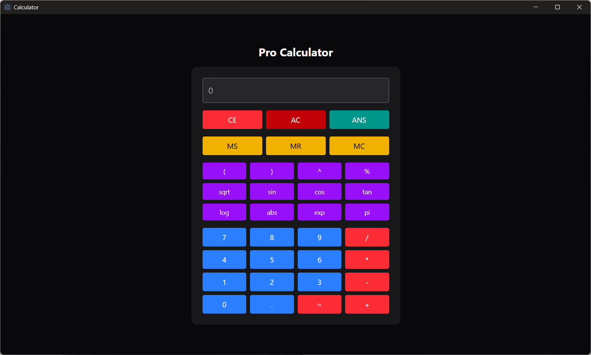

# 🧮 Advanced Calculator

A powerful and user-friendly web-based calculator built with **React** and **Tailwind CSS**, featuring advanced mathematical functions, expression history, keyboard input support, and memory management. Built using the secure [`expr-eval`](https://github.com/silentmatt/expr-eval) parser — no `eval()` used!

---

## ✨ Features

- ✅ Basic operations: `+`, `-`, `×`, `÷`, `%`, `^`
- ✅ Advanced functions: `sin`, `cos`, `tan`, `sqrt`, `log`, `abs`, `exp`
- ✅ Constants: `pi`, `ans` (last answer)
- ✅ Parentheses support for complex expressions
- ✅ Memory functions: `MS` (save), `MR` (recall), `MC` (clear)
- ✅ Full keyboard support
- ✅ Scrollable history view
- ✅ Mobile-friendly responsive UI
- ✅ CSP-safe (no `eval`)

---

## 🚀 Live Demo
Download the [Latest Desktop App](https://github.com/drummerviswa/electron-calculator/releases/download/v1.0.0/basic-calculator-1.0.0-setup.exe)  

---

## 📸 Screenshots

 
---

## 🛠️ Tech Stack

- **React** (with Hooks)
- **Tailwind CSS** (utility-first styling)
- **expr-eval** for expression parsing

---

## 🧩 Installation

```bash
# 1. Clone the repository
git clone https://github.com/drummerviswa/electron-calculator.git
cd electron-calculator

# 2. Install dependencies
npm install

# 3. Start the development server
npm run dev
